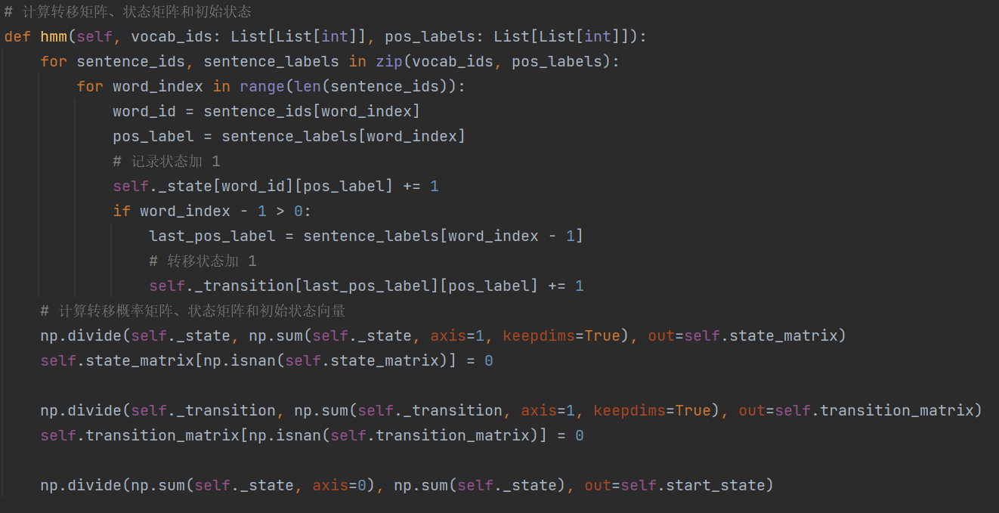
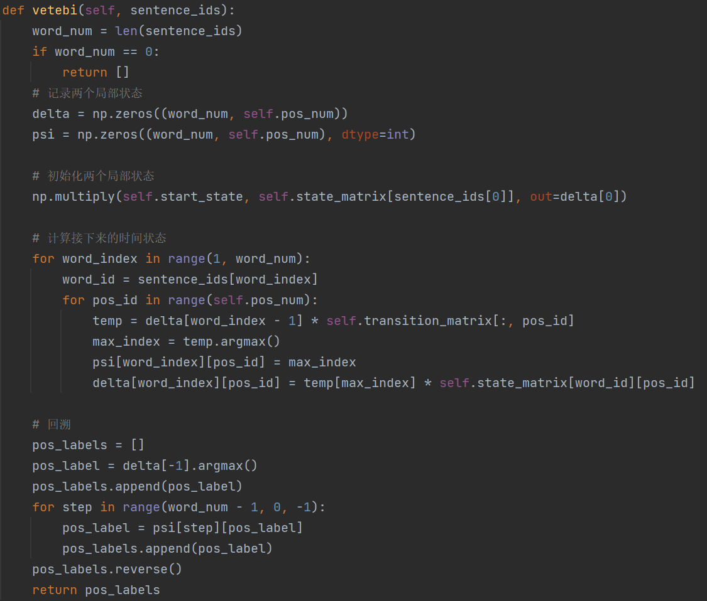
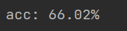

# HMM 实验报告

## 1. 实验原理

序列 $s = a_1a_2...a_n$，其对应的词性为 $l = l_1,l_2...l_n$。

已知序列集 $S = \{s_1, s_2,...,s_m\}$，对应的词性集合 $L = \{l_1,l_2,...,l_m\}$，其中词表的大小为 $M$, 词性集大小为$N$；

得出状态转移矩阵 $A_{N \times N}$  、观测状态矩阵 $B_{M \times N}$ 和初始状态分布向量 $\Pi_N$ 。

其中 $A_{ij}$ 表示从词性 $i$ 转移到词性 $j$ 的概率；$B_{ij}$ 表示单词 $i$ 的词性为 $j$ 的概率；$\Pi_i$ 表示词性为 $i$ 的概率

输入一序列 $s$，其长度为 $T$, 要求其对应的词性序列 $l$，可通过维特比算法求解：

1. 初始化局部状态：

$$
\begin{gathered}
\delta_{1}(i)=\pi_{i} b_{i}\left(o_{1}\right), i=1,2 \ldots N \\
\Psi_{1}(i)=0, i=1,2 \ldots N
\end{gathered}
$$

2. 递推时刻 $t=2,3,...,T$ 时刻的局部状态:

$$
\begin{aligned}
&\delta_{t}(i)=\max _{1 \leq j \leq N}\left[\delta_{t-1}(j) a_{j i}\right] b_{i}\left(0_{t}\right), i=1,2 \ldots N \\
&\Psi_{t}(i)=\arg \max _{1 \leq j \leq N}\left[\delta_{t-1}(j) a_{j i}\right], i=1,2 \ldots N
\end{aligned}
$$

3. 计算时刻 $T$ 最大的 $\Psi_{t}(i)$, 即为时刻 $T$ 最可能的隐藏状态:

$$
\begin{gathered}
P_{*}=\max _{1 \leq j \leq N} \delta_{T}(i) \\
i_{T}^{*}=\arg \max _{1 \leq j \leq N}\left[\delta_{T}(i)\right]
\end{gathered}
$$

4. 利用局部状态 $\Psi_{t}(i)$ 开始回溯，对于 $t=T−1,T−2,...,1$：

$$
i_{t}^{*}=\Psi_{t+1}\left(i_{t+1}^{*}\right)
$$

* 最终得到最有可能的词性序列 $I^{*}=\left\{i_{1}^{*}, i_{2}^{*}, \ldots i_{T}^{*}\right\}$

## 2. 实验过程

数据处理：

1. 修正词性集外的错误标注，nhf 和 nhs 修正为 nh，mq 修正为 m
2. 读取数据集，得到单词序列集合和对应的词性集合
3. 统计词表，并将单词序列集合转化为对应的词表 id 序列集合；将词性集合转换为对应的标签集合
4. 按 9 : 1 随机划分训练集和测试集

关键代码：

1. 计算转移矩阵、状态矩阵和初始状态向量

   

2. 利用维特比算法求词性

   

实验结果：

输出测试集正确率：

## 3. 实验总结

1. 掌握了 HMM 维特比算法的求解原理
2. 本次实验利用 HMM 算法求解了词性标注问题
3. 通过本次实验，能够将该算法推广应用到实际问题中去
