# 机器学习实验一

## 数据处理

1. 将数据集随机打乱，按 9 : 1 将数据集分为训练集和测试集。
2. 对于感知机和支持向量机采用 $\pm 1$ 标签；对于逻辑回归采用 0-1 标签。

关键代码：

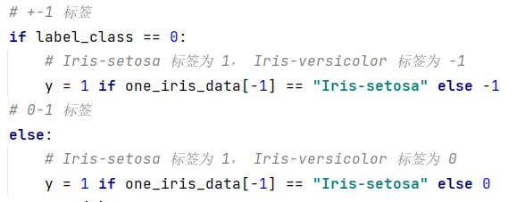

## 感知机

* 根据误分类点跟新参数：

关键代码：

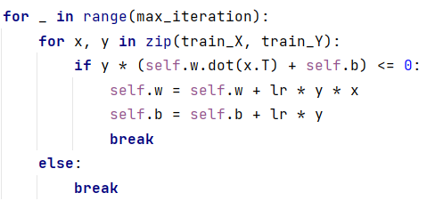

实验参数：

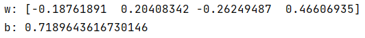

实验结果：

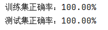

## SVM

* 检查 $\alpha$ 是否符合 KKT 条件：

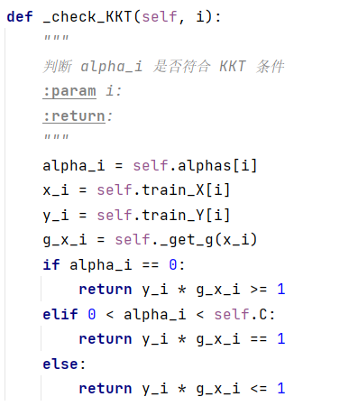

* 选择要更新的参数：

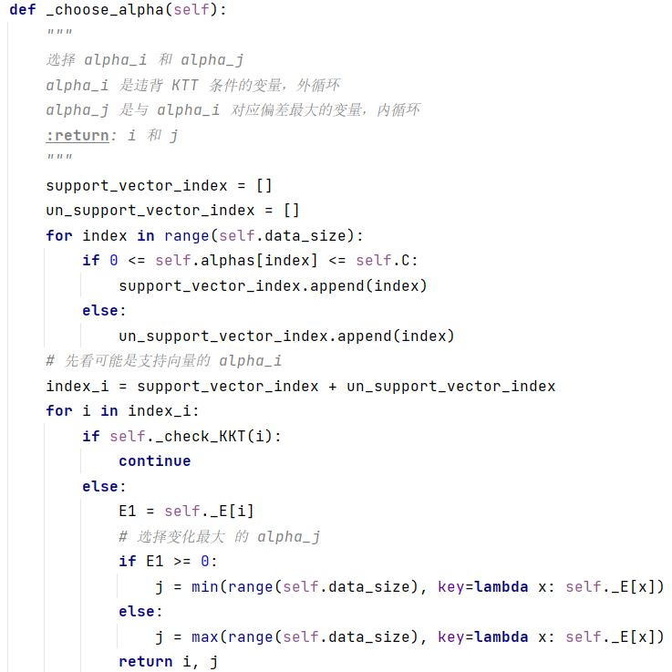

* SMO 是支持向量机优化的关键算法：

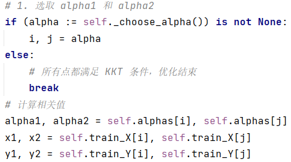

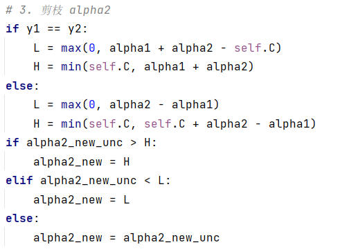

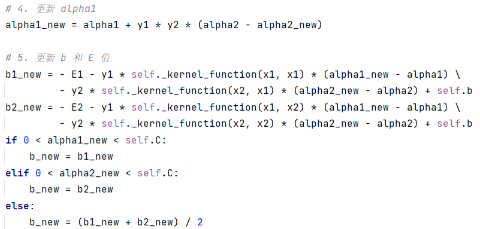

实验参数：

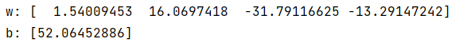

实验结果：

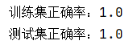

## 逻辑回归

* 采用梯度下降法跟新参数

关键代码：

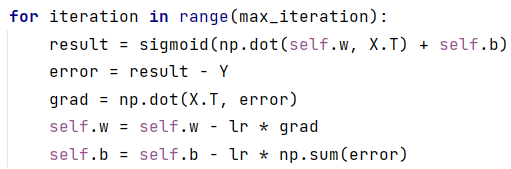

实验参数：

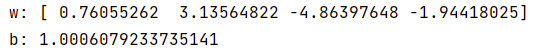

实验结果：

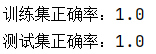

## 实验总结

本次实验，完成了感知机、支持向量机和逻辑回归模型的实现，对这些模型有了更加深刻的理解，并能够在实际问题中应用这些模型。

