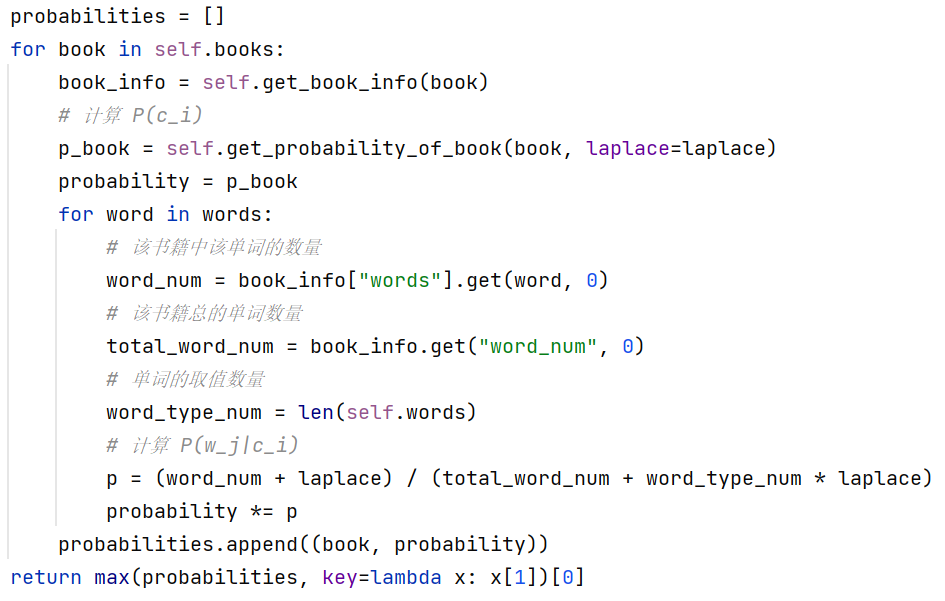
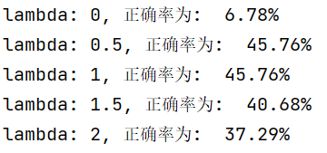

# 朴素贝叶斯

## 原理

由贝叶斯公式：
$$
P(A|B) = \frac{P(AB)}{P(B)},
$$
得：
$$
P(B|A) = \frac{P(B) \times P(A|B)}{P(A)}.
$$

有书籍 $C = \{c_1, c_2, ..., c_m\}$；文本 $W = \{w_1, w_2, ... , w_n\}$，对于 $ \forall i \ne j(i, j = 1, 2, ..., n)$ 有 $w_i$ 和 $w_j$  相互独立。

那么 $W$ 出自书籍 $c_i(i=1, 2,..,m)$  的概率为：
$$
P(c_i|W) = \frac{P(c_i) \times P(W|c_i)}{P(W)}  = \frac{P(c_i) \times \prod_{j=1}^{n} P(w_j|c_i)}{P(W)},
$$

由于 $P(W)$ 相同，只需比较 $P(c_i) \times \prod_{j=1}^{n} P(w_j|c_i)$ 的大小。

为了防止训练集不充分导致概率估计为 0 的情况，添加拉普拉斯平滑：
$$
P(w_j|c_i) = \frac{|D_{c_i}, w_j| + \lambda}{|D_{c_i}| + N_j \lambda},
$$
其中 $N_j$ 为 $w_j$ 的取值数量。

## 实验

数据处理：

* 以每一行文本作为一条数据，随机打乱数据，以 9 : 1 划分训练集和测试集

关键代码：

实验结果：

## 实验总结

* 朴素贝叶斯在假定条件独立的前提下，通过先验概率求后验概率，是一种简单有效的算法
* 通过拉普拉斯平滑能够防止训练集不充分导致概率估计为 0 的情况，提高正确率
* 正确率与拉普拉斯算子的值有关
